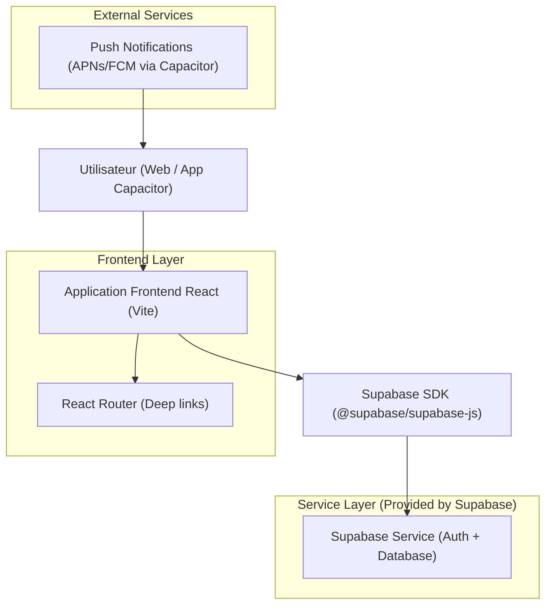
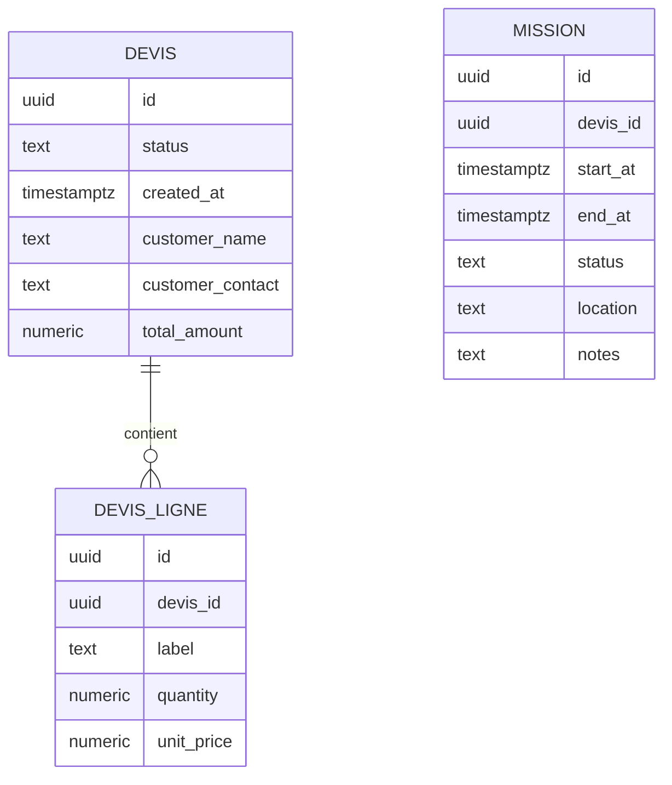

## 1.Architecture design


## 2.Technology Description
- Frontend: React@18 + react-router-dom@6 + Vite@5
- UI/Utils: lucide-react, dayjs/date-fns (formatting), TypeScript@5
- Notifications: @capacitor/push-notifications, @capacitor/local-notifications
- Backend: Supabase (Auth + PostgreSQL) via @supabase/supabase-js (utilisé côté frontend)

## 3.Route definitions
| Route | Purpose |
|-------|---------|
| /admin/devis/:devisId | Afficher le détail complet d’un devis ; support ouverture depuis notification (devisId dans payload) |
| /admin/planning/missions/:missionId | Afficher le détail d’une mission planifiée ; support ouverture depuis notification (missionId dans payload) |
| /admin/planning/jour?date=YYYY-MM-DD | Afficher le planning en vue jour + “Total heures” calculé à partir de la date affichée |

## 6.Data model(if applicable)

### 6.1 Data model definition


### 6.2 Data Definition Language
Devis (devis)
```sql
CREATE TABLE devis (
  id UUID PRIMARY KEY DEFAULT gen_random_uuid(),
  status TEXT NOT NULL,
  created_at TIMESTAMPTZ NOT NULL DEFAULT NOW(),
  customer_name TEXT,
  customer_contact TEXT,
  total_amount NUMERIC(12,2) DEFAULT 0
);

-- Accès: lecture basique anon (si nécessaire), plein accès authenticated
GRANT SELECT ON devis TO anon;
GRANT ALL PRIVILEGES ON devis TO authenticated;
```

Lignes de devis (devis_ligne)
```sql
CREATE TABLE devis_ligne (
  id UUID PRIMARY KEY DEFAULT gen_random_uuid(),
  devis_id UUID NOT NULL, -- FK logique
  label TEXT NOT NULL,
  quantity NUMERIC(12,3) NOT NULL DEFAULT 1,
  unit_price NUMERIC(12,2) NOT NULL DEFAULT 0
);

CREATE INDEX idx_devis_ligne_devis_id ON devis_ligne(devis_id);

GRANT SELECT ON devis_ligne TO anon;
GRANT ALL PRIVILEGES ON devis_ligne TO authenticated;
```

Missions / Planning (mission)
```sql
CREATE TABLE mission (
  id UUID PRIMARY KEY DEFAULT gen_random_uuid(),
  devis_id UUID, -- FK logique
  start_at TIMESTAMPTZ NOT NULL,
  end_at TIMESTAMPTZ NOT NULL,
  status TEXT NOT NULL,
  location TEXT,
  notes TEXT
);

CREATE INDEX idx_mission_start_at ON mission(start_at);
CREATE INDEX idx_mission_end_at ON mission(end_at);

GRANT SELECT ON mission TO anon;
GRANT ALL PRIVILEGES ON mission TO authenticated;
```
