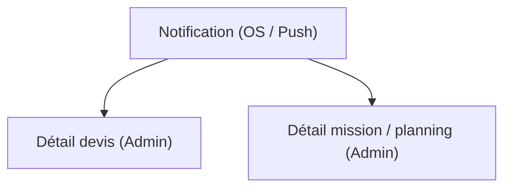

## 1. Product Overview

Permettre à un admin d’ouvrir directement un devis ou une mission/planning depuis une notification, et fiabiliser l’affichage du total d’heures selon le jour consulté dans le planning.
Objectif : réduire le temps de traitement côté admin et éviter les erreurs de lecture du planning.

## 2. Core Features

### 2.1 User Roles

| Role  | Registration Method         | Core Permissions                                                                                  |
| ----- | --------------------------- | ------------------------------------------------------------------------------------------------- |
| Admin | Compte existant + connexion | Accéder aux pages admin, consulter détails devis et missions/planning, consulter le planning jour |

### 2.2 Feature Module

1. **Détail devis (Admin)** : affichage complet du devis, cohérence des montants, accès depuis notification (deep link).
2. **Détail mission / planning (Admin)** : affichage complet d’une mission planifiée, accès depuis notification (deep link).
3. **Planning (Vue jour) (Admin)** : liste des missions du jour, total heures calculé à partir du jour affiché.

### 2.3 Page Details

| Page Name                         | Module Name                    | Feature description                                                                                                                                                                                                                                    |
| --------------------------------- | ------------------------------ | ------------------------------------------------------------------------------------------------------------------------------------------------------------------------------------------------------------------------------------------------------ |
| Détail devis (Admin)              | Résolution depuis notification | Ouvrir la page à partir des données de notification (type=devis + id) ; afficher un état de chargement ; gérer “devis introuvable / accès refusé”.                                                                                                     |
| Détail devis (Admin)              | En-tête & contexte             | Afficher identifiant devis, statut, date, client (minimum : nom + contact si disponible) ; afficher fil d’Ariane et bouton retour.                                                                                                                     |
| Détail devis (Admin)              | Contenu “devis complet”        | Afficher lignes/éléments du devis (désignation, quantité, prix), sous-totaux, total ; afficher informations complémentaires utiles au traitement (notes/références si présentes).                                                                      |
| Détail mission / planning (Admin) | Résolution depuis notification | Ouvrir la page à partir des données de notification (type=mission/planning + id) ; afficher un état de chargement ; gérer “mission introuvable / accès refusé”.                                                                                        |
| Détail mission / planning (Admin) | En-tête & contexte             | Afficher identifiant mission, statut, date, créneau horaire ; afficher fil d’Ariane et bouton retour.                                                                                                                                                  |
| Détail mission / planning (Admin) | Détails mission                | Afficher les informations structurées de la mission : lieu, intervenant(s) si attribués, description/notes si présentes ; afficher la durée et les heures (début/fin).                                                                                 |
| Planning (Vue jour) (Admin)       | Sélecteur de jour              | Afficher le jour courant ; permettre de changer le jour (précédent/suivant + sélection date) ; rafraîchir la liste et les indicateurs selon le jour choisi.                                                                                            |
| Planning (Vue jour) (Admin)       | Liste du jour                  | Lister les missions du jour (heure, client/lieu si disponible, statut) ; permettre d’ouvrir le détail mission.                                                                                                                                         |
| Planning (Vue jour) (Admin)       | Total heures (correction)      | Calculer et afficher le total d’heures uniquement à partir des missions appartenant au jour affiché (pas le jour système, ni une autre plage) ; gérer fuseau horaire et missions à cheval sur minuit en comptant uniquement la partie du jour affiché. |

## 3. Core Process

**Flux Admin – ouverture depuis notification (devis)**

1. L’admin reçoit une notification “Devis …”.
2. Il/elle tape la notification.
3. L’application résout le deep link (type + id) et ouvre “Détail devis (Admin)”.
4. La page charge les données, affiche le devis complet, ou un message “introuvable/indisponible”.

**Flux Admin – ouverture depuis notification (mission/planning)**

1. L’admin reçoit une notification “Mission …”.
2. Il/elle tape la notification.
3. L’application résout le deep link (type + id) et ouvre “Détail mission / planning (Admin)”.
4. La page charge les données, affiche la mission, ou un message “introuvable/indisponible”.

**Flux Admin – consultation planning jour + total heures corrigé**

1. L’admin ouvre le planning en vue “Jour”.
2. Il/elle change le jour affiché.
3. La liste des missions se met à jour.
4. “Total heures” est recalculé à partir des missions affichées pour ce jour (en respectant le fuseau et les chevauchements minuit).

